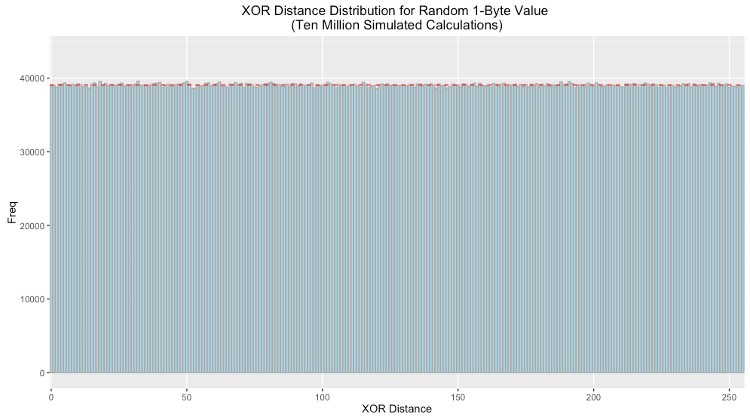

**KFS is a local file storage system inspired by Kademlia.**

[](https://travis-ci.org/Storj/kfs)
[](https://coveralls.io/r/Storj/kfs)
[](https://www.npmjs.com/package/kfs)
[](https://raw.githubusercontent.com/storj/kfs/master/LICENSE)

The KFS system describes a method for managing the storage layer of nodes on 
the [Storj Network] by creating a sharded local database where 
content-addressable data is placed in a shard using the same routing metric
and algorithm used by the [Kademlia] distributed hash table.

Quick Start
-----------

Install the `kfs` package using [Node Package Manager].

```
npm install kfs --save
```

This will install `kfs` as a dependency of your own project. See the 
[documentation](https://storj.github.io/kfs/) for usage details. You can also install globally to 
use the `kfs` command line utility.

Motivation
----------

The Storj network consists of a number of distributed peers who provide 
storage capacity for lease to others. In its current implementation, these 
nodes store encrypted shards and their associated metadata in a [LevelDB]. 
LevelDB provides a number of features that make it desirable for this use 
case; this includes its lexicographically sorted keys providing fast lookups 
for content-addressable values, fast and efficient compression, and perhaps 
most notably its portability which allows the Storj software to run on a 
wide range of hardware including dated or underpowered computers.

However, due to the nature of LevelDB's design and its implementation in 
the Storj software, its performance suffers after the size of the database 
exceeds approximately 100GiB. This impact is larger on lower end systems and 
can also vary based on the type of disk in use. These performance issues seem 
to arise from LevelDB's compaction mechanism (which is an otherwise desirable 
feature). In addition to the cost of compaction, LevelDB blocks reads and 
writes during this process, which causes storage nodes to become effectively 
offline until the process completes. 

These properties indicate that if the size of a single database can be given an 
upper bound, then the cost of compaction can be significantly reduced to an 
acceptable level. Futhermore, in using a single database, if one level becomes 
corrupted, deleted, or otherwise inaccessible, the entire database may become 
unusable and unrecoverable. For these reasons, the KFS system seeks to create 
a series of size-capped databases where data is stored in a given "shard" 
based on a deterministic metric to ensure a sufficiently random and even 
spread to bound the cost of compaction, to reduce the impact of corruption, and 
to completely eliminate the need to maintain an index or state machine to
efficiently lookup stored data.

Mechanics
---------

### S-Buckets and Routing

KFS requires that there be a reference identifier, which can be any arbitrary 
`R` bit key. This can be randomly generated upon creation of the database or 
derived from some other application or protocol specific information. In the 
Storj network, nodes are addressed with a 160 bit node identifier derived from 
the public portion of an ECDSA key pair. This *Reference ID* is used to 
calculate the database shard or *S-Bucket* to which a given piece of data 
belongs. Collectively, these S-Buckets form the *B-Table*.

In KFS, there are a total of `B` S-Buckets, numbered `0`-`B-1`. To determine 
which bucket a piece of raw binary data belongs in, calculate the [distance] 
between the first byte of the hash of the data and the first byte of the 
reference ID. This is to say that if the distance between those bytes is 137, 
then the raw binary data should be stored in S-Bucket 137. An S-Bucket has a 
fixed size, `S`, in bytes. This means that a KFS database has a maximum size of 
`B * S` bytes. Once an S-Bucket is full, no more data can be placed in it. Once 
a KFS database is full, another should be created using a new Reference ID. 
Given the default constants, KFS databases are capped at a maximum of 8TiB each.

### Keying Data by Chunks

To optimize the efficiency of reads and writes in KFS, data is stored in `C` 
sized chunks (or less), keyed by the full content's hash, followed by a 
space and a numerical index. This is performed to ensure that key/value pairs 
are small and that reading and writing data to and from a S-Bucket is done 
sequentially and can allow for efficient streaming of data both in and out of 
the S-bucket.

Since LevelDB sorts items lexicographically, keys for data chunks should be 
strings and consist of:

> Hexidecimal(Hash) + ' ' + 00000N

The number of preceding zeroes in the numerical index should be set such that 
a S-Bucket that contains only a single file split into `C` sized chunks  can 
still be read sequentially from the database. Using the default constants 
would make the highest number index 262144, so the number of leading zeroes 
should be less than or equal to five.

### Ad-Hoc S-Bucket Initialization

Given the low cost of creating and opening a LevelDB, it is not necessary to 
create all `B` S-Buckets at once. Instead, an S-Bucket can be created the first 
time data is to be stored inside of it. Additionally, S-Buckets can be opened 
and closed as needed, eliminating the potential overhead of opening a large 
number of file descriptors. Operations on a given S-Bucket should be added to 
a queue which when drained may trigger a close of the S-Bucket's underlying 
database.

Kademlia's metric for determining distance is defined as the result of 
the XOR operation on a set of bits interpreted as an integer. As such, for 
two randomly generated sets of bits, the result is uniformly distributed. Therefore
the XOR distance between pseudo-random first bytes of the reference ID and hash 
give any bucket an equal chance of being selected. 

Below is the frequency distribution plotted with ten million simulated calculations.
As expected the distribution is uniform (the red dotted line indicates the theoretical
value each bin should have): 



Even with a uniform distribution, as the node reaches capacity some buckets will fill sooner than others. 
Offers that would be sorted into these buckets should be declined and relayed to other nodes.

Constants
---------

| Name | Description                        | Default               |
|------|------------------------------------|-----------------------|
| B    | Number of columns in the B-table   | 256                   |
| S    | Size (in bytes) of an S-Bucket     | 34359738368 (32GiB)   |
| C    | Size (in bytes) of a file chunk    | 131072                |
| R    | Number of bits in the Reference ID | 160                   |

Considerations Specific to Storj
--------------------------------

* Storj farmers receive contracts for data shards that are already close to 
  their own Node ID. To improve S-Bucket distribution, it may be desirable to 
  double hash the data or otherwise force a degree of randomness before 
  selecting a S-Bucket for storage.
* The use of KFS in the Storj network creates an upper limit to how much data 
  can be stored by a given Node ID (or identity). This encourages farmers to 
  operate multiple nodes with different identities which lends itself to better 
  network integration.
* The use of HD (hierachical deterministic) private keys could allow a single 
  farmer identity to assume multiple Reference IDs, thus eliminating the limit.
* KFS does not track or store metadata about the contents of a S-Bucket, which 
  in the context of the Storj network would include contracts and other special 
  information related to a piece of data. Applications should handle this via 
  their own means.

License
-------

KFS - A Local File Storage System Inspired by Kademlia  
Copyright (C) 2016 Storj Labs, Inc

This program is free software: you can redistribute it and/or modify
it under the terms of the GNU General Public License as published by
the Free Software Foundation, either version 3 of the License, or
(at your option) any later version.

This program is distributed in the hope that it will be useful,
but WITHOUT ANY WARRANTY; without even the implied warranty of
MERCHANTABILITY or FITNESS FOR A PARTICULAR PURPOSE.  See the
GNU General Public License for more details.

You should have received a copy of the GNU General Public License
along with this program.  If not, see [http://www.gnu.org/licenses/].

[Kademlia]: https://en.wikipedia.org/wiki/Kademlia "Kademlia"
[Storj Network]: https://storj.io "Storj Labs"
[LevelDB]: http://leveldb.org/ "LevelDB"
[distance]: https://en.wikipedia.org/wiki/Kademlia#Routing_tables
[Node Package Manager]: https://npmjs.org "Node Package Manager"
[documentation]: http://bookch.in/kfs/ "Package Documentation"
